# AI4ALL Resource Hub

A curated collection of learning resources for the AI4ALL program, organized by week and theme. Browse the full hub at:

**[https://ai4allresources.github.io](https://ai4allresources.github.io)**

---

## Overview

Each week of the AI4ALL curriculum is broken into three focused topics, with 2–3 hand-picked resources per topic. Resources include official documentation, video walkthroughs, interactive tools, datasets, and AI4ALL-produced materials.

All resources are also available in a single downloadable file:

> 📊 **[AI4ALL_Resources.xlsx](./AI4ALL_Resources.xlsx)** — the complete resource list in one Excel spreadsheet, with columns for Week, Theme, Topic, Resource Title, Source, Date, URL, and Notes.

---

## Curriculum Structure

```mermaid
flowchart TD
    HUB["🌐 AI4ALL Resource Hub"]

    HUB --> W1["Week 1\nIntroduction &\nProject Management"]
    HUB --> W2["Week 2\nWhat is AI\nand Data?"]
    HUB --> W3["Week 3\nData Exploration"]
    HUB --> W4["Week 4\nMachine Learning\nPart 1"]
    HUB --> W5["Week 5\nMachine Learning\nPart 2"]
    HUB --> W6["Week 6\nCollaboration Tools"]
    HUB --> W8["Week 8\nTraining an\nML Model"]
    HUB --> W9["Week 9\nModern ML\nApplications"]
    HUB --> W11["Week 11\nModel Deployment"]

    W1 --> W1A["Project Management"]
    W1 --> W1B["Scope & SMART Goals"]
    W1 --> W1C["EdSTEM"]

    W2 --> W2A["What is ML/AI?"]
    W2 --> W2B["Data Sourcing"]
    W2 --> W2C["Data Types"]

    W3 --> W3A["Data Cleaning"]
    W3 --> W3B["Data Transformations"]
    W3 --> W3C["Data Visualizations"]

    W4 --> W4A["Supervised Learning"]
    W4 --> W4B["Unsupervised Learning"]
    W4 --> W4C["Training & Testing Data"]

    W5 --> W5A["Computer Vision"]
    W5 --> W5B["Natural Language Processing"]
    W5 --> W5C["Transfer Learning"]

    W6 --> W6A["Version Control"]
    W6 --> W6B["GitHub"]
    W6 --> W6C["Virtual Environments / Docker"]

    W8 --> W8A["Confusion Matrix"]
    W8 --> W8B["Accuracy / AUC / ROC"]
    W8 --> W8C["k-Fold Cross Validation"]

    W9 --> W9A["LLM Prompt Engineering"]
    W9 --> W9B["Hugging Face / API Calls to LLM"]
    W9 --> W9C["PySpark / Cloud"]

    W11 --> W11A["Deployment"]
    W11 --> W11B["MLOps"]
    W11 --> W11C["Monitoring"]
```



---

## Week-by-Week Breakdown

### Week 1 — Introduction & Project Management
Getting your bearings: how to scope an AI project, set SMART goals, and use the tools your team will rely on throughout the program.

| Topic | # Resources |
|---|---|
| Project Management | 3 |
| Scope & SMART Goals | 2 |
| EdSTEM | 2 |

### Week 2 — What is AI and Data?
A conceptual foundation covering the AI/ML landscape and how data is sourced and categorized.

| Topic | # Resources |
|---|---|
| What is ML/AI? | 1 |
| Data Sourcing | 3 |
| Data Types | 2 |

### Week 3 — Data Exploration
Hands-on data work: cleaning messy datasets, applying transformations, and building visualizations.

| Topic | # Resources |
|---|---|
| Data Cleaning | 3 |
| Data Transformations | 3 |
| Data Visualizations | 3 |

### Week 4 — Machine Learning Part 1
The fundamentals of ML: supervised and unsupervised learning, and how to properly split data for training and testing.

| Topic | # Resources |
|---|---|
| Supervised Learning | 3 |
| Unsupervised Learning | 3 |
| Training & Testing Data | 3 |

### Week 5 — Machine Learning Part 2
Going deeper into applied ML with computer vision, natural language processing, and transfer learning.

| Topic | # Resources |
|---|---|
| Computer Vision | 2 |
| Natural Language Processing | 3 |
| Transfer Learning | 2 |

### Week 6 — Collaboration Tools
The developer workflow: version control with Git, working with GitHub repositories, and managing environments with Docker.

| Topic | # Resources |
|---|---|
| Version Control | 3 |
| GitHub | 3 |
| Virtual Environments / Docker | 3 |

### Week 8 — Training an ML Model
Understanding how to evaluate model performance using standard metrics and validation strategies.

| Topic | # Resources |
|---|---|
| Confusion Matrix | 3 |
| Accuracy / AUC / ROC | 3 |
| k-Fold Cross Validation | 2 |

### Week 9 — Modern ML Applications
Working with large language models, Hugging Face, external APIs, and cloud-scale data processing with PySpark.

| Topic | # Resources |
|---|---|
| LLM Prompt Engineering | 2 |
| Hugging Face / API Calls to LLM | 2 |
| PySpark / Cloud | 2 |

### Week 11 — Model Deployment
Taking a trained model to production: deployment pipelines, MLOps practices, and ongoing monitoring.

| Topic | # Resources |
|---|---|
| Deployment | 3 |
| MLOps | 2 |
| Monitoring | 2 |

---

## Repository Structure

```
AI4ALLResources.github.io/
├── index.html                                      # Main hub landing page
├── AI4ALL_Resources.xlsx                           # All resources in one spreadsheet
├── Week_01_Introduction_and_Project_Management/
│   └── Introduction_and_Project_Management.html
├── Week_02_What_is_AI_and_Data/
│   └── What_is_AI_and_Data.html
├── Week_03_Data_Exploration/
│   └── Data_Exploration.html
├── Week_04_Machine_Learning_Part_1/
│   └── Machine_Learning_Part_1.html
├── Week_05_Machine_Learning_Part_2/
│   └── Machine_Learning_Part_2.html
├── Week_06_Collaboration_Tools/
│   └── Collaboration_Tools.html
├── Week_08_Training_an_ML_Model/
│   └── Training_an_ML_Model.html
├── Week_09_Modern_ML_Applications/
│   └── Modern_ML_Applications.html
└── Week_11_Model_Deployment/
    └── Model_Deployment.html
```

---

## About AI4ALL

[AI4ALL](https://ai-4-all.org) is a nonprofit working to increase diversity and inclusion in AI education. This resource hub is maintained by program staff to support students throughout the curriculum.
